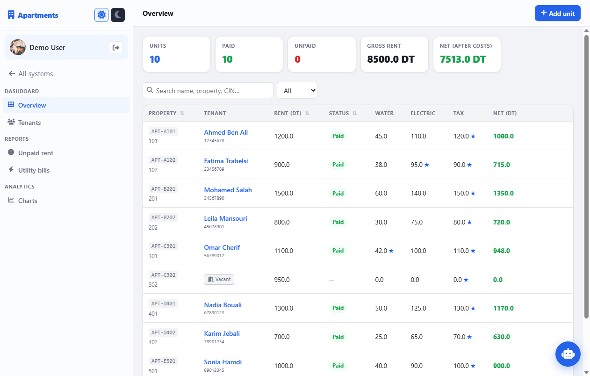
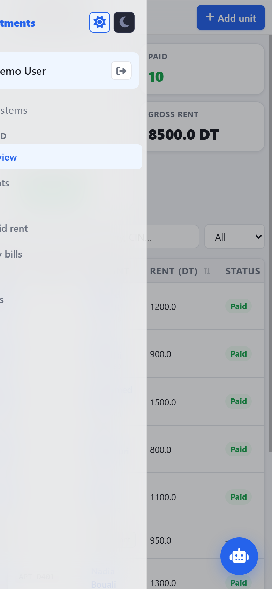

# Tripartite System

A self-hosted manager for **apartments, a store, and a farm** — one login, three
modules, plus an AI assistant. Runs as a local web app on your own machine, and
installs to your phone as a PWA over HTTPS.

Built with Flask and vanilla JavaScript. No build step, no bundler, no cloud
dependency: the whole front end is plain HTML/CSS/JS in `static/`.



---

## Contents

- [Features](#features)
- [Quick start](#quick-start)
- [Repository layout](#repository-layout)
- [Accounts & security](#accounts--security)
- [Running over HTTPS (for phones)](#running-over-https-for-phones)
- [The motion layer](#the-motion-layer)
- [API reference](#api-reference)
- [Tests](#tests)
- [Troubleshooting](#troubleshooting)

---

## Features

**Apartments / rental**
- Units with tenant details, rent, status (paid / unpaid / partial), due dates
- Utility bills — water, electricity, tax — with per-item "landlord pays" flags
- Net income after landlord-covered costs, with running totals
- Sortable, searchable table; filter by status; per-tenant bill breakdown
- Charts view

**Store**
- Product catalogue with buy/sell prices, stock levels, images
- Point-of-sale flow with discounts and part payments
- Installment tracking and payment history per sale
- Low-stock and out-of-stock notifications

**Agriculture**
- Farms, tree blocks and worker records
- Harvest logging with projected vs. actual yield
- Per-farm and per-project cost/profit totals

**Platform**
- **AI assistant** (NVIDIA NIM) that sees your live data and can propose
  concrete changes — an editable action card appears for you to confirm
- **Offline-first**: reads and writes go through `localStorage`, and changes made
  offline are queued and replayed on reconnect
- **Two-factor auth** (TOTP, works with any authenticator app) plus QR scanning
- **Installable PWA** with a service worker for offline use
- Light and dark themes
- Superadmin panel to manage users and impersonate an account for support

---

## Quick start

Requires **Python 3.9+**.

```bash
# 1. Install dependencies
python -m pip install -r requirements.txt

# 2. Create your data file from the example
#    (Windows)  copy data.example.json data.json
#    (macOS/Linux)  cp data.example.json data.json

# 3. Optional: add a demo account with 10 units, 10 products and 10 farms
python seed_demo.py

# 4. Run it
python launcher.py
```

The app opens at <http://127.0.0.1:5050> and leaves a tray icon you can use to
reopen or quit it.

Prefer a visible console? Run `python server.py` instead.

### What you need to supply

| Feature | Needs |
| --- | --- |
| Everything except the AI assistant | nothing |
| AI assistant | an NVIDIA NIM API key — add it in **Profile → API Keys** (stored per account, server-side) |

---

## Repository layout

```
server.py            Flask app: all routes, JSON-file persistence, NIM proxy
launcher.py          Desktop entry point — hidden server + browser + tray icon
start_https.py       HTTPS mode: generates a local CA, serves via cheroot
seed_demo.py         One-shot script that creates the demo account
Tripartite.spec      PyInstaller recipe for a standalone .exe

static/
  motion.js          Spring physics engine (interruptible animation + gestures)
  shared.js          App logic: auth, offline sync, data access, UI helpers
  shared.css         Design system: tokens, materials, typography, components
  *.html             One page per module (login, hub, rental, store, …)
  sw.js              Service worker (offline shell + background sync)
  manifest.json      PWA manifest

tests/
  verify-motion.js   Numerical checks on the spring math (Node, no browser)
  verify-ui.js       Live browser verification over the Chrome DevTools Protocol
  make_example_data.py  Regenerates data.example.json with all personal data stripped

data.example.json    Sanitised starting data — copy to data.json
requirements.txt     Python dependencies
```

**Data model:** everything lives in one `data.json` next to the script, keyed by
username, with `units`, `store_items` and `farms` arrays per user. No database.

---

## Accounts & security

### Change the admin password first

The superadmin credentials are read from the environment, falling back to
built-in defaults so a fresh clone runs immediately:

| Variable | Default | Purpose |
| --- | --- | --- |
| `TRI_ADMIN_USER` | `mainAdmin` | Superadmin username |
| `TRI_ADMIN_PASS` | *(a weak built-in default)* | Superadmin password |
| `TRI_ADMIN_STRICT` | unset | Set to `1` to **refuse to start** while the default password is unchanged |

```bash
# Windows (PowerShell)
$env:TRI_ADMIN_PASS = 'a-strong-password'

# macOS / Linux
export TRI_ADMIN_PASS='a-strong-password'

python launcher.py
```

The superadmin can see and act on **every** account, so set a real password
before this is reachable from anything but your own machine. Setting
`TRI_ADMIN_STRICT=1` makes the app refuse to boot until you do.

Other accounts are created through the in-app **Register** tab.

### Stored-data model

This is a local-first app meant to run on your own machine. It is **not**
hardened for the public internet:

- **Passwords are stored in plain text** in `data.json`. Acceptable for a
  personal tool on your own device; not appropriate for a multi-tenant host.
- `data.json` can also contain a TOTP secret and an NVIDIA API key, so it must
  stay out of version control — `.gitignore` already excludes it.
- The HTTPS certificates (`*.pem`) contain a **private key**. They are gitignored
  and regenerated per machine by `start_https.py`.

If you publish a fork, run `python tests/make_example_data.py` rather than
committing your own `data.json`, and double-check the diff before pushing.

---

## Running over HTTPS (for phones)

Browsers only allow PWA installation and offline storage on a secure origin, so
serving over plain HTTP to a phone won't let you install the app. `start_https.py`
solves this properly, using the same model as `mkcert`:

1. A local **root CA** (`rootCA.pem`) that you install once on each device.
2. A **leaf certificate** (`cert.pem`) signed by that CA, listing `localhost` and
   your LAN IP.

```bash
python start_https.py
```

It will:

- generate the CA and leaf certificate if needed (they are per-machine and
  contain your LAN IP, so they are not committed),
- ask for **one** Windows admin prompt to open the firewall port and trust the CA
  on this PC,
- serve over TLS with `cheroot`, a faster multithreaded server than Flask's dev
  server.

To trust it on your phone:

1. Open `https://<your-ip>:5050/rootCA.pem` and download it.
2. **Android:** Settings → Security & privacy → More security → Install a
   certificate → CA certificate.
   **iOS:** Settings → General → VPN & Device Management → install the profile,
   then enable it under Certificate Trust Settings.
3. Reopen the site — it should show as secure, and **Install App** will appear.

---

## The motion layer

`static/motion.js` is a dependency-free spring engine, written from the guidance
in Apple's *Designing Fluid Interfaces*. It exists because CSS transitions and
`@keyframes` cannot be **interrupted**: once started they run to completion, so a
panel caught mid-flight cannot follow your finger back.

The engine solves the damped-harmonic-oscillator equation in **closed form**
rather than stepping it with Euler integration. That is not a detail — explicit
Euler adds numerical damping that silently eats the overshoot a low damping ratio
is supposed to produce, and it goes unstable on long frames. The closed form is
exact, frame-rate independent, and cannot blow up.

Public surface:

```js
Motion.spring(el, { x: 0, scale: 1 }, { damping: 1, response: 0.32 });
Motion.gesture(el, { axis: 'x', bounds: [-300, 0], onEnd: g => { /* g.velocity */ } });
Motion.project(velocity);        // momentum projection
Motion.rubberband(overshoot, d); // soft boundary resistance
Motion.haptic(10);               // vibration, same frame as the visual
```

Parameters follow Apple's model: **damping** controls overshoot (`1.0` = no
bounce), **response** is how quickly it settles in seconds — not a duration. A
spring has no fixed duration; its settle time emerges from those two values.
Presets ship in `Motion.tokens`.

It also honours the accessibility media queries: under
`prefers-reduced-motion: reduce`, movement collapses to a short cross-fade rather
than being removed outright, and `prefers-reduced-transparency` and
`prefers-contrast` are respected by the stylesheet.

What this buys you in the UI:

- Modals and bottom sheets you can grab and reverse mid-animation
- A mobile drawer that tracks your finger 1:1, rubber-bands at the edges, and
  inherits your release velocity so there is no seam between dragging and animating
- A flick decided by the **sign of the velocity**, not just where you let go



*The drawer mid-flight — a translucent material with the dashboard still visible
through it.*

---

## API reference

All routes are JSON, session-cookie authenticated. 53 routes in total; the
main ones:

| Method | Route | Purpose |
| --- | --- | --- |
| `POST` | `/api/login` | Sign in (may return `totp_required`) |
| `POST` | `/api/login/totp` | Complete a 2FA challenge |
| `POST` | `/api/register` | Create an account |
| `GET` | `/api/me` | Current user + settings |
| `POST` | `/api/logout` | End the session |
| `GET`/`POST` | `/api/units` | List / create rental units |
| `PUT`/`DELETE` | `/api/units/<id>` | Update / remove a unit |
| `POST` | `/api/units/monthly_reset` | Mark all units unpaid (month rollover) |
| `GET`/`POST` | `/api/store/items` | List / create products |
| `POST` | `/api/store/sell` | Record a sale (supports installments) |
| `GET`/`POST` | `/api/farms` | List / create farms |
| `POST` | `/api/sync` | Replay a batch of offline operations |
| `POST` | `/api/ai/chat` | Proxy to NVIDIA NIM with your data as context |
| `GET` | `/api/ping` | Health check |

The superadmin may act on any account by appending `?as=<username>`.

---

## Tests

Two suites, both runnable without installing anything else.

```bash
# Spring mathematics — overshoot, frame-rate independence, momentum, interrupts
node tests/verify-motion.js

# The real app in a real browser (needs the app running on :5050)
python launcher.py
node tests/verify-ui.js
```

`verify-motion.js` asserts the physics: that damping `1.0` never overshoots,
that lower damping overshoots more, that a re-targeted spring does not teleport,
and that velocity survives a reversal.

`verify-ui.js` drives headless Chrome over the DevTools Protocol, signs in as the
demo account, walks every page, and checks for uncaught exceptions, that modals
actually animate rather than snapping, that the drawer travels on and off screen,
that reduced motion degrades gracefully, and that nothing overflows at phone
width. It writes reference screenshots to `shots/`.

Both exit non-zero on failure, so they work in CI.

---

## Troubleshooting

**`ModuleNotFoundError: No module named 'flask'`**
Run `python -m pip install -r requirements.txt`.

**It exits immediately with a `UnicodeEncodeError`**
Your console codepage can't represent a character in a startup message. Startup
output is ASCII-only for this reason; if you add `print()` calls, keep them ASCII
or the app will die before the server binds.

**`ERROR: port 5050 is already in use`**
Another copy is running — check the tray icon, or
`Get-NetTCPConnection -LocalPort 5050`.

**The site looks stale after an update**
The service worker is cache-first. Bump `STATIC_V` in `static/sw.js` and reload;
the new worker drops the old cache on activation.

**Phone can't reach the server**
You need HTTPS mode for PWA features, and both devices on the same network. Check
the firewall rule `Tripartite System 5050` exists.

**Chrome shows a certificate warning**
The root CA isn't trusted on that device yet — see
[Running over HTTPS](#running-over-https-for-phones).

---

## License

MIT — see [LICENSE](LICENSE).
